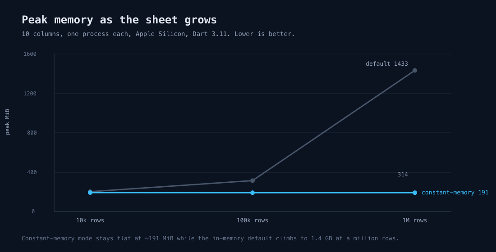

# xlsxwriter


A native, fast, low-memory Excel `.xlsx` **writer** for Dart. It is an FFI
binding to [libxlsxwriter](https://github.com/jmcnamara/libxlsxwriter) by John
McNamara, a mature C library, compiled from vendored source at build time.

This package writes spreadsheets. It does not read them. If you need to read or
edit existing files, use [`excel_community`](https://pub.dev/packages/excel_community)
(the maintained fork of `excel`) or
[`spreadsheet_decoder`](https://pub.dev/packages/spreadsheet_decoder). The niche
here is the export and report-generation path: turning rows of data into an
`.xlsx` quickly and with low memory, including a constant-memory mode for sheets
that do not fit comfortably in RAM. It also writes native Excel charts, which
the pure-Dart writers can't.

## Quick start

```dart
import 'package:xlsxwriter/xlsxwriter.dart';

void main() {
  final workbook = Workbook('report.xlsx');
  final sheet = workbook.addWorksheet('Summary');

  sheet.writeString(0, 0, 'Item');
  sheet.writeString(0, 1, 'Amount');
  sheet.writeString(1, 0, 'Widgets');
  sheet.writeNumber(1, 1, 1250);

  // close() is what writes the file. Always call it.
  workbook.close();
}
```

Rows and columns are 0-based integers, matching libxlsxwriter: `(0, 0)` is cell
`A1`, `(1, 2)` is `C2`.

## A row at a time

A report is usually a list per row, so `writeRow` takes one and picks the right
cell type per value: a `String` writes text, an `int` or `double` a number, a
`bool` a boolean, a `DateTime` a date, and `null` a blank.

```dart
final date = workbook.addFormat().numberFormat('yyyy-mm-dd');
sheet.writeRow(0, ['Item', 'Qty', 'Price', 'Added']); // header
sheet.writeRow(1, ['Widget', 12, 4.99, DateTime.utc(2026, 7, 20)],
    dateFormat: date);
```

A `DateTime` needs a `dateFormat` to render as a date rather than a serial, so
one is required when the row has a date; a value of an unsupported type is an
`ArgumentError` naming the column, not a silent coercion.

## Formatting

Create a `Format` with `workbook.addFormat()` and pass it to any write call. The
setters return the format, so they chain:

```dart
final header = workbook.addFormat()
  ..bold()
  ..fontColor(0xFFFFFF)
  ..backgroundColor(0x4472C4)
  ..align(Alignment.center)
  ..border(Border.thin);

sheet.writeString(0, 0, 'Total', header);
```

Colors are 24-bit RGB integers, `0xRRGGBB`. The full set of attributes is
`bold`, `italic`, `underline`, `fontName`, `fontSize`, `fontColor`,
`backgroundColor`, `numberFormat`, `align`, `verticalAlign`, `textWrap`,
`border`, and `borderColor`. A single format can be reused for any number of
cells.

## Dates and numbers

Excel stores dates as numbers, so a date cell needs a format that carries a date
number format:

```dart
final dateFormat = workbook.addFormat()..numberFormat('yyyy-mm-dd');
sheet.writeDateTime(0, 0, DateTime(2026, 7, 17), dateFormat);

final money = workbook.addFormat()..numberFormat(r'$#,##0.00');
sheet.writeNumber(1, 0, 1999.5, money);
```

Both integers and doubles go through `writeNumber`; Excel has a single numeric
type.

## Tables

Wrap a written range in an Excel table to get banded rows, a filter dropdown on
each column, and a name you can use in formulas, which is what most reports and
exports want. Pass the column names; they are written into the header row for
you.

```dart
sheet.writeString(1, 0, 'Widgets');
sheet.writeNumber(1, 1, 1250);
// ... more rows ...
sheet.addTable(
  0, 0, 3, 1, // A1:B4
  name: 'Sales',
  columns: ['Item', 'Amount'],
);
```

`autofilter`, `bandedRows`, `bandedColumns` and `totalRow` toggle the matching
table features. Excel writes the default `Column1`, `Column2`... names over the
header cells when `columns` is omitted, so pass it whenever the header matters.

## Charts

Write a real Excel chart from data already on a sheet. Add the chart, give it one
or more series that reference cell ranges by formula, and drop it onto a sheet.
The pure-Dart `excel` and `spreadsheet_decoder` packages can't produce charts at
all, so this is the reason to reach for a native writer when a report needs one.

```dart
const items = ['Widgets', 'Gadgets', 'Gizmos'];
const units = [1250, 340, 55];
for (var i = 0; i < items.length; i++) {
  sheet.writeString(i, 0, items[i]);
  sheet.writeNumber(i, 1, units[i]);
}

final chart = workbook.addChart(ChartType.column)
  ..setTitle('Units sold')
  ..setAxisNames(category: 'Item', value: 'Units')
  ..addSeries(
    categories: r'=Sheet1!$A$1:$A$3',
    values: r'=Sheet1!$B$1:$B$3',
    name: 'Units',
  );
sheet.insertChart(0, 3, chart); // top-left at D1
```

`ChartType` covers `column`, `bar`, `line`, `area`, `pie`, `doughnut`, `scatter`
and `radar`. A chart can plot several series (call `addSeries` more than once)
and read data from any sheet in the workbook, since the ranges name their sheet.
Scale it with `insertChart(row, col, chart, xScale: 2.0, yScale: 1.5)`.

## Images

`insertImage` places a PNG, JPEG, GIF or BMP at a cell, straight from bytes in
memory, which is the shape a logo or a rendered chart already has, so no
temporary file is needed:

```dart
sheet.insertImage(0, 0, File('logo.png').readAsBytesSync());
sheet.insertImage(4, 2, chartPng, xScale: 0.5, yScale: 0.5, yOffset: 4);
```

`xScale`/`yScale` resize it (1.0 is native size) and `xOffset`/`yOffset` nudge it
within the cell in pixels. Bytes that are not an image libxlsxwriter recognises
throw an `XlsxWriterException`.

## Conditional formatting

The report and dashboard set: highlight cells by value, and colour a range as a
heatmap or a data bar.

```dart
// Highlight amounts over 1000 in red.
final red = workbook.addFormat().backgroundColor(0xFFC7CE);
sheet.conditionalCell(1, 1, 99, 1,
    criteria: ConditionalCriteria.greaterThan, value: 1000, format: red);

// A green-to-red heatmap down a column (pass midColor for a 3-colour scale).
sheet.conditionalColorScale(1, 2, 99, 2,
    minColor: 0x63BE7B, maxColor: 0xF8696B);

// In-cell data bars proportional to each value.
sheet.conditionalDataBar(1, 3, 99, 3, barColor: 0x638EC6);
```

Each takes the range as `(firstRow, firstCol, lastRow, lastCol)`. `conditionalCell`
covers the comparisons in `ConditionalCriteria` (greater than, less than, equal,
and so on); `conditionalCellBetween` takes a `min` and `max`. Colours are
`0xRRGGBB`, the same as `Format`.

## Constant-memory mode for large sheets

The default workbook holds everything in memory until `close()`. For very large
exports, open the workbook in constant-memory mode. Each row is flushed to a
temporary file as the next row begins, so memory stays roughly flat no matter
how many rows you write:

```dart
final workbook = Workbook.constantMemory('big.xlsx');
final sheet = workbook.addWorksheet();
for (var row = 0; row < 1000000; row++) {
  sheet.writeString(row, 0, 'row $row');
  sheet.writeNumber(row, 1, row * 1.5);
}
workbook.close();
```

The trade-off is ordering: cells must be written top-to-bottom, and left-to-right
within a row. Once you start a new row the previous one is on disk and can no
longer be changed. Data written out of order is dropped.

## Bytes for a server response

To serve a generated spreadsheet straight from a request handler, without naming
and cleaning up a scratch file, use `Workbook.toBytes`. You build the workbook the
same way; it stages a temporary file, reads it back, and removes it for you:

```dart
final bytes = Workbook.toBytes((workbook) {
  final sheet = workbook.addWorksheet('Summary');
  sheet.writeString(0, 0, 'Item');
  sheet.writeNumber(0, 1, 42);
});

// e.g. with shelf:
// return Response.ok(bytes, headers: {
//   'content-type':
//       'application/vnd.openxmlformats-officedocument.spreadsheetml.sheet',
//   'content-disposition': 'attachment; filename="report.xlsx"',
// });
```

Pass `constantMemory: true` to build a large sheet with flat memory, with the same
top-to-bottom ordering rule as above.

## Benchmark

Write-only, 100,000 rows by 10 columns (one text column, nine numeric), each
engine measured in its own process for an isolated peak-memory reading.
Single machine (Apple Silicon, Dart 3.11), so treat these as indicative, not a
spec:


| engine                          |   time | peak memory |
| ------------------------------- | -----: | ----------: |
| `xlsxwriter` (constant memory)  | 0.87 s |      191 MiB |
| `xlsxwriter` (default)          | 1.29 s |      314 MiB |
| `excel_community` 2.2.0         | 1.47 s |      614 MiB |
| `excel` 4.0.6                   | 4.63 s |     1778 MiB |

Compare against `excel_community`, not `excel`. `excel` has had no release since
August 2024, so beating it by 5x is not the interesting number; the maintained
fork is what you would otherwise use, and against that the honest figures are
**3.2x less memory and 1.7x faster**. Memory is the real argument here and it
widens as rows grow, because constant-memory mode stays roughly flat while an
in-memory writer keeps climbing. On throughput alone the fork is close enough
that it should not decide anything.

One caveat in the competitors' favour: the two pure-Dart runs wrote plain values
with no number formats or dates, so they did slightly less work than the
`xlsxwriter` run they are compared against.
Reproduce with `dart run bench/bench.dart` (this package) and see `bench/bench.dart`
for the workload. Numbers vary by machine and Dart version; do not treat them as
guaranteed.

That memory argument is the whole reason to reach for constant-memory mode, and
it is worth seeing on its own. Measured at three sizes, the same 10 columns:



| rows | default (in memory) | constant memory |
| ---- | ------------------: | --------------: |
| 10k  | 202 MiB | 192 MiB |
| 100k | 314 MiB | 191 MiB |
| 1M   | 1433 MiB | 191 MiB |

Constant-memory mode holds the same footprint whether the sheet is ten thousand
rows or a million, because it flushes each row to disk as it goes instead of
building the whole workbook in memory. That is the mode for an export that might
not fit in RAM. The default is faster to reach for on small sheets and lets you
go back and edit cells you have already written; constant-memory gives that up
for the flat curve.

## Platforms and requirements

- Dart 3.10 or newer. The native library is built by a Dart build hook the
  first time you run or test the package.
- A C toolchain on the build machine (the standard compiler on each platform):
  Clang or GCC on macOS and Linux, MSVC on Windows. No system libraries are
  needed; both libxlsxwriter and zlib are vendored and compiled from source, so
  the package is self-contained on macOS, Linux, and Windows.
- Flutter support will follow once build hooks (native assets) are stable for
  Flutter; today build hooks target the Dart standalone runtime.

## How it works


The build hook (`hook/build.dart`) compiles the vendored libxlsxwriter sources,
a vendored copy of zlib, and a small C shim into one dynamic library using
`package:native_toolchain_c`. The Dart API binds the shim with `dart:ffi`. The
shim exists mostly to give every entry point a stable, exported C ABI (which
also makes symbol lookup work under MSVC on Windows).

## Credits and license

This package is a binding. The engine that does the real work is
[libxlsxwriter](https://github.com/jmcnamara/libxlsxwriter) by **John McNamara**,
licensed under the BSD 2-Clause license. Please credit that project for the
`.xlsx` writing itself.

The Dart binding code is licensed under the MIT license (see `LICENSE`). The
vendored C sources keep their own licenses: libxlsxwriter (BSD 2-Clause), zlib
(zlib license), and the small permissive libraries libxlsxwriter bundles
(minizip, md5, dtoa, tmpfileplus). Details are in `src/third_party/README.md`.
