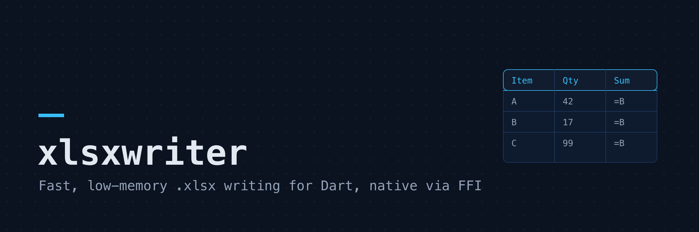
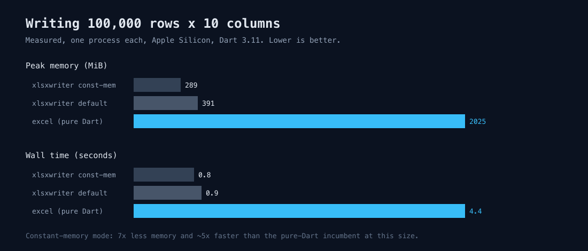
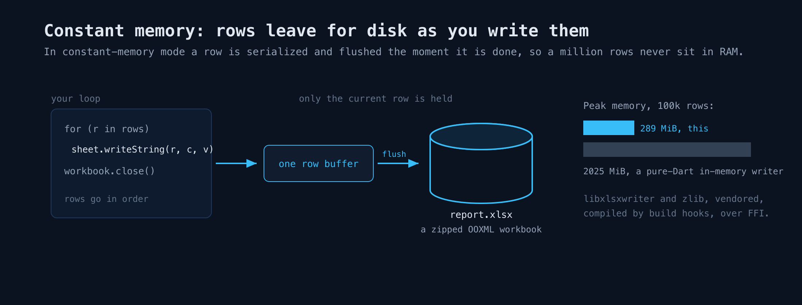

# xlsxwriter



A native, fast, low-memory Excel `.xlsx` **writer** for Dart. It is an FFI
binding to [libxlsxwriter](https://github.com/jmcnamara/libxlsxwriter) by John
McNamara, a mature C library, compiled from vendored source at build time.

This package writes spreadsheets. It does not read them. If you need to read or
edit existing files, use [`excel`](https://pub.dev/packages/excel) or
[`spreadsheet_decoder`](https://pub.dev/packages/spreadsheet_decoder). The niche
here is the export and report-generation path: turning rows of data into an
`.xlsx` quickly and with low memory, including a constant-memory mode for sheets
that do not fit comfortably in RAM.

## Quick start

```dart
import 'package:xlsxwriter/xlsxwriter.dart';

void main() {
  final workbook = Workbook('report.xlsx');
  final sheet = workbook.addWorksheet('Summary');

  sheet.writeString(0, 0, 'Item');
  sheet.writeString(0, 1, 'Amount');
  sheet.writeString(1, 0, 'Widgets');
  sheet.writeNumber(1, 1, 1250);

  // close() is what writes the file. Always call it.
  workbook.close();
}
```

Rows and columns are 0-based integers, matching libxlsxwriter: `(0, 0)` is cell
`A1`, `(1, 2)` is `C2`.

## Formatting

Create a `Format` with `workbook.addFormat()` and pass it to any write call. The
setters return the format, so they chain:

```dart
final header = workbook.addFormat()
  ..bold()
  ..fontColor(0xFFFFFF)
  ..backgroundColor(0x4472C4)
  ..align(Alignment.center)
  ..border(Border.thin);

sheet.writeString(0, 0, 'Total', header);
```

Colors are 24-bit RGB integers, `0xRRGGBB`. The full set of attributes is
`bold`, `italic`, `underline`, `fontName`, `fontSize`, `fontColor`,
`backgroundColor`, `numberFormat`, `align`, `verticalAlign`, `textWrap`,
`border`, and `borderColor`. A single format can be reused for any number of
cells.

## Dates and numbers

Excel stores dates as numbers, so a date cell needs a format that carries a date
number format:

```dart
final dateFormat = workbook.addFormat()..numberFormat('yyyy-mm-dd');
sheet.writeDateTime(0, 0, DateTime(2026, 7, 17), dateFormat);

final money = workbook.addFormat()..numberFormat(r'$#,##0.00');
sheet.writeNumber(1, 0, 1999.5, money);
```

Both integers and doubles go through `writeNumber`; Excel has a single numeric
type.

## Tables

Wrap a written range in an Excel table to get banded rows, a filter dropdown on
each column, and a name you can use in formulas, which is what most reports and
exports want. Pass the column names; they are written into the header row for
you.

```dart
sheet.writeString(1, 0, 'Widgets');
sheet.writeNumber(1, 1, 1250);
// ... more rows ...
sheet.addTable(
  0, 0, 3, 1, // A1:B4
  name: 'Sales',
  columns: ['Item', 'Amount'],
);
```

`autofilter`, `bandedRows`, `bandedColumns` and `totalRow` toggle the matching
table features. Excel writes the default `Column1`, `Column2`... names over the
header cells when `columns` is omitted, so pass it whenever the header matters.

## Constant-memory mode for large sheets

The default workbook holds everything in memory until `close()`. For very large
exports, open the workbook in constant-memory mode. Each row is flushed to a
temporary file as the next row begins, so memory stays roughly flat no matter
how many rows you write:

```dart
final workbook = Workbook.constantMemory('big.xlsx');
final sheet = workbook.addWorksheet();
for (var row = 0; row < 1000000; row++) {
  sheet.writeString(row, 0, 'row $row');
  sheet.writeNumber(row, 1, row * 1.5);
}
workbook.close();
```

The trade-off is ordering: cells must be written top-to-bottom, and left-to-right
within a row. Once you start a new row the previous one is on disk and can no
longer be changed. Data written out of order is dropped.

## Bytes for a server response

To serve a generated spreadsheet straight from a request handler, without naming
and cleaning up a scratch file, use `Workbook.toBytes`. You build the workbook the
same way; it stages a temporary file, reads it back, and removes it for you:

```dart
final bytes = Workbook.toBytes((workbook) {
  final sheet = workbook.addWorksheet('Summary');
  sheet.writeString(0, 0, 'Item');
  sheet.writeNumber(0, 1, 42);
});

// e.g. with shelf:
// return Response.ok(bytes, headers: {
//   'content-type':
//       'application/vnd.openxmlformats-officedocument.spreadsheetml.sheet',
//   'content-disposition': 'attachment; filename="report.xlsx"',
// });
```

Pass `constantMemory: true` to build a large sheet with flat memory, with the same
top-to-bottom ordering rule as above.

## Benchmark

Write-only, 100,000 rows by 10 columns (one text column, nine numeric), each
engine measured in its own process for an isolated peak-memory reading.
Single machine (Apple Silicon, Dart 3.11), so treat these as indicative, not a
spec:



| engine                          |   time | peak memory |
| ------------------------------- | -----: | ----------: |
| `xlsxwriter` (default)          |  0.9 s |      391 MiB |
| `xlsxwriter` (constant memory)  |  0.8 s |      289 MiB |
| `excel` (pure Dart)             |  4.4 s |     2025 MiB |

At this size `xlsxwriter` writes the file about five times faster than `excel`
and uses a fraction of the memory. The gap in memory widens as rows grow: the
constant-memory mode stays roughly flat while an in-memory writer keeps climbing.
Reproduce with `dart run bench/bench.dart` (this package) and see `bench/bench.dart`
for the workload. Numbers vary by machine and Dart version; do not treat them as
guaranteed.

## Platforms and requirements

- Dart 3.10 or newer. The native library is built by a Dart build hook the
  first time you run or test the package.
- A C toolchain on the build machine (the standard compiler on each platform):
  Clang or GCC on macOS and Linux, MSVC on Windows. No system libraries are
  needed; both libxlsxwriter and zlib are vendored and compiled from source, so
  the package is self-contained on macOS, Linux, and Windows.
- Flutter support will follow once build hooks (native assets) are stable for
  Flutter; today build hooks target the Dart standalone runtime.

## How it works



The build hook (`hook/build.dart`) compiles the vendored libxlsxwriter sources,
a vendored copy of zlib, and a small C shim into one dynamic library using
`package:native_toolchain_c`. The Dart API binds the shim with `dart:ffi`. The
shim exists mostly to give every entry point a stable, exported C ABI (which
also makes symbol lookup work under MSVC on Windows).

## Credits and license

This package is a binding. The engine that does the real work is
[libxlsxwriter](https://github.com/jmcnamara/libxlsxwriter) by **John McNamara**,
licensed under the BSD 2-Clause license. Please credit that project for the
`.xlsx` writing itself.

The Dart binding code is licensed under the MIT license (see `LICENSE`). The
vendored C sources keep their own licenses: libxlsxwriter (BSD 2-Clause), zlib
(zlib license), and the small permissive libraries libxlsxwriter bundles
(minizip, md5, dtoa, tmpfileplus). Details are in `src/third_party/README.md`.
